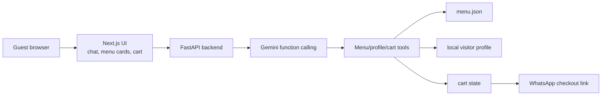

# AI Waiter Architecture



## Runtime Flow

1. The guest sends a natural-language food request from the chat UI.
2. FastAPI builds context from `menu.json`, `restaurant_config.json`, and the visitor profile.
3. Gemini can call structured tools for menu search, preference updates, and cart changes.
4. The frontend renders assistant text, menu cards, and live cart deltas.
5. Checkout formats the cart into a WhatsApp deep link for the restaurant.

## Evidence Fixture

Run this without an API key:

```bash
python examples/replay_order_flow.py
```

It writes `results/sample_conversation.json`, `results/cart_state.json`, and `results/whatsapp_checkout.json`.
